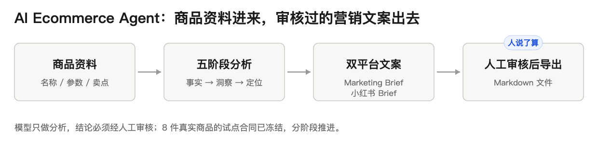
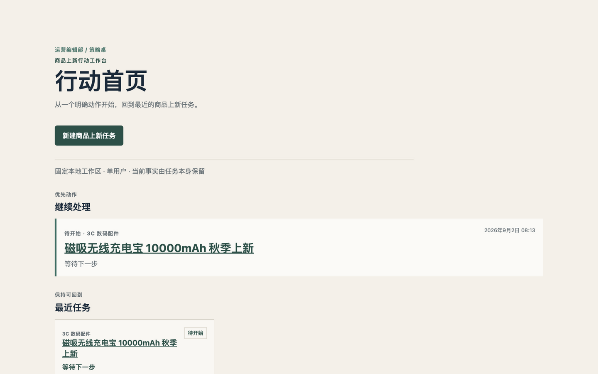
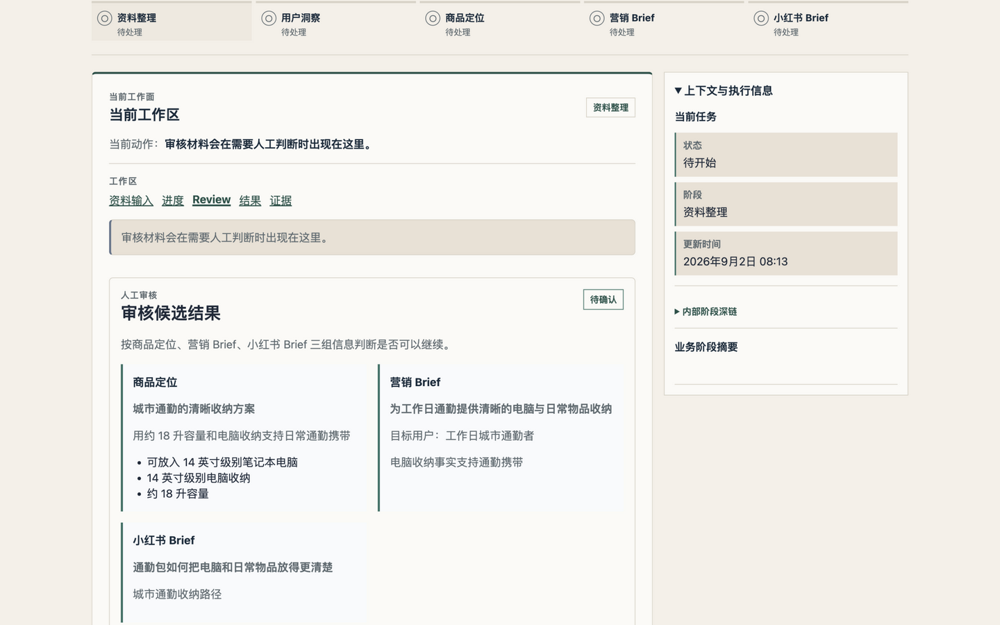
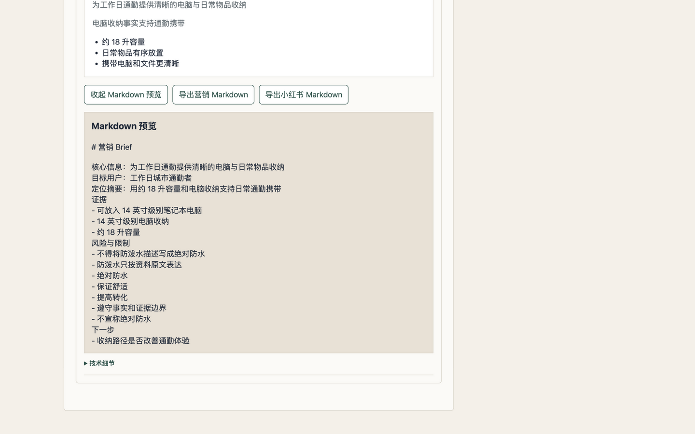

# AI Ecommerce Agent

## 这是什么

AI Ecommerce Agent 是一个**本地优先的电商上新策略 Agent 工作台**，面向中小电商运营：输入商品资料，产出经过人工审核的五层结果——商品事实、用户洞察、产品定位、平台中性的 Marketing Brief、小红书 Brief，并以 Markdown 导出。

核心工作流是确定性的五阶段 Agent 流程，模型只在受控边界内做语义分析，**Human Review 是最终决策点**。小红书是第一个演示适配器，核心与平台无关。

## 验证状态（2026-09-02，对访客）

| 验证 | 状态 | 证据 |
|---|---|---|
| 端到端功能验收 | 3 组仿真业务场景全部通过：浏览器 → FastAPI → PostgreSQL 跑通创建、重载、审核与双 Brief 导出；非法输入正确阻断 | Issue #329 / PR #330（L2 持久化验收） |
| 真实商品试点 | 8 件真实商品（P01–P08）已完成入组评审与试点合同冻结，分母恰为 8；P0–P6 分阶段门禁串行推进 | Issue #341 / PR #342、试点合同 |
| 首次授权真实运行 | 已在导出阶段失败，按合同**终止处置**：授权已消耗、零静默重试、零输入替换，以决策记录重建基线 | Issue #335 / PR #336（`L5_REAL_AI_ACCEPTANCE_FAIL_NO_EXPORTS`）、DEC-087 |
| 真实 P01 运行 | **尚未执行**（`P01_ATTEMPT_EXECUTED = NO`，待新授权） | 下方仓库状态区 |

全程 Issue / PR + CI 门禁推进：一 Issue 一可观测结果，独立评审后才合并。

> 下方"Current status"区是仓库治理的权威状态记录，面向协作者与执行 Agent；上方表格是同一事实的访客版摘要，两者口径一致。

  

以上均为本地 Docker-only 生命周期实跑截图（2026-09）：输入商品资料 → 确定性五阶段流水线 → 人工审核双 Brief → 确认后导出 Markdown；全程无需外部 Provider。

> **Current status:** [MVP-0L Local AI Web App Delivery Goal](docs/goals/mvp0-local-ai-web-app-delivery-goal.md) is `TERMINAL_INCOMPLETE_L5_FAILED`; [Real Product-to-Brief Pilot Goal](docs/goals/real-product-to-brief-pilot-goal.md) is `ACTIVE`. Issue #341 / PR #342 is merge-effective: P01–P08 are `ADMITTED`, the denominator is exactly eight frozen units, and P0 is `P0_CONTRACT_FROZEN`. Issue #343 / PR #344 is merge-effective P1 provider-free characterization `CONFIRMED` (historical first-failure attribution remains `INCONCLUSIVE`). Issue #345 / PR #346 is merge-effective and the response-key harness repair is complete at base `8c43068038d4c3859383d68263f0ab0336480f6a`. Issue #347 / PR #349 is merge-effective P2 provider-free readiness at `main@cb77de2f96954a2d63ef00eead2f93bea1197649`. Issue #350 / PR #351 is merge-effective operator-binder readiness at `main@4e9a57d5c3db77e38d0cc3e9b87151aecbaf1b7a`; `OPERATOR_BINDER_IMPLEMENTED = YES` is current. Issue #352 / PR #353 is merge-effective control alignment at `main@87f5315074bb3858ff09163c38c84b6e1e834577`; `REAL_P01_EXECUTION_CONTROL_ALIGNED = YES` is durable main truth. Issue #355 is the current bounded provider-free execution-control correction on its replacement branch; no merge or execution authorization is implied.
>
> The current L0 activation authority is [DEC-084](docs/decisions/dec-084-apple-silicon-local-ai-web-app-goal.md), [Session-009](docs/sessions/session-009-local-ai-web-app-goal-activation.md) and the successor Goal. The completed [MVP-0P Local Action Workbench Productization Goal](docs/goals/mvp0-local-action-workbench-productization-goal.md) is its historical predecessor. The [MVP-0 Fast Lane Goal](docs/goals/mvp0-fast-lane-goal.md) remains a terminal `GOAL_BLOCKED` historical execution record, and the original [end-to-end MVP-0 Goal](docs/goals/end-to-end-demo-mvp0-goal.md) remains historical traceability.
>
> [DEC-087](docs/decisions/dec-087-mvp0l-terminal-rebaseline-and-pilot-activation.md) amends DEC-084's unfinished L5→L6 continuation and DEC-086's inactive prerequisite. L0–L4 evidence remains preserved. The single [#335](https://github.com/JettxonHo/ai-ecommerce-agent/issues/335) / [PR #336](https://github.com/JettxonHo/ai-ecommerce-agent/pull/336) L5 attempt is terminal `L5_REAL_AI_ACCEPTANCE_FAIL_NO_EXPORTS` at `2210d68ad6e09e1a402dd63b0cd9b2a52cdfe74f`, with no export files; authorization is consumed and no further run is authorized. L6 is `NOT_EXECUTED`, Agent UI is frozen, Issue #341 / PR #342 supplies the merge-effective P0 freeze, Issue #343 / PR #344 supplies merge-effective P1 characterization, Issue #345 / PR #346 supplies merge-effective response-key repair, and Issue #347 / PR #349 supplies merge-effective provider-free P2 readiness. Issue #350 / PR #351 is merge-effective at `main@4e9a57d5c3db77e38d0cc3e9b87151aecbaf1b7a`. Issue #352 / PR #353 is merge-effective at `main@87f5315074bb3858ff09163c38c84b6e1e834577`; Issue #355 records the bounded provider-free control correction without authorizing Pilot execution. See [Session-011](docs/sessions/session-011-mvp0l-terminal-rebaseline.md), [Session-012](docs/sessions/session-012-real-product-to-brief-pilot-p0.md), [Session-013](docs/sessions/session-013-real-product-to-brief-pilot-p1.md), the [P1 harness-repair review](docs/reviews/real-product-to-brief-pilot-p1-harness-repair.md), [P2 readiness review](docs/reviews/real-product-to-brief-pilot-p2-readiness.md), [Session-015](docs/sessions/session-015-real-product-to-brief-pilot-p2-readiness.md), the [P2 operator-binder review](docs/reviews/real-product-to-brief-pilot-p2-operator-binder.md), [Session-016](docs/sessions/session-016-real-product-to-brief-pilot-p2-operator-binder.md), and the [Issue #355 correction review](docs/reviews/real-product-to-brief-pilot-p2-real-p01-execution-control-correction.md).

> **Issue #355 current truth (pre-merge):** `main@925a0318135784429096ddf30de2a34982c55bc0` is the exact base for the bounded provider-free execution-control correction. The replacement branch is under implementation; no merge or execution authorization is implied. `REAL_P01_INPUT_FILE_READY = YES` reflects the Owner-frozen handoff and was not re-inspected by this implementation. `REAL_P01_PRE_CALL = BLOCKED_BY_EXECUTION_CONTROL_CORRECTION`; `REAL_P01_GRANT = NOT_ISSUED`; `P01_ATTEMPT_EXECUTED = NO`; `P01_RESULT = NOT_EXECUTED`; `Blocker 3 = UNKNOWN_NOT_INSPECTED`; Provider calls, Secret reads/injections, PostgreSQL access, Pilot/participant executions and charge remain zero. After an independently reviewed merge, a fresh exact-main provider-free pre-call is required; the real P01 Grant remains unissued.

## Product

本节的权威产品定义与上方"这是什么"一致；本仓库的 README 同时承担 Agent 治理入口职能，访客可只读顶部两节，协作者请继续阅读状态区与"Execution entry points"。

AI Ecommerce Agent is a local, fixed-workspace product-launch strategy workbench for small ecommerce operators. It turns user-provided product information into:

- grounded product facts;
- customer insight;
- product positioning;
- a platform-neutral Marketing Brief;
- a Xiaohongshu Brief;
- a Markdown export reviewed by the user.

The core is platform-neutral. Xiaohongshu is the first demonstration adapter. The main workflow is deterministic; constrained model calls perform semantic analysis, and one human review remains the final decision point.

[DEC-082](docs/decisions/dec-082-local-single-user-action-workbench-and-kimi-frontend-routing.md) and [DEC-083](docs/decisions/dec-083-local-action-workbench-productization-goal.md) describe the completed local Action Workbench predecessor. Its final review merged in PR #315, making `MVP0P_GOAL_COMPLETE` historical current truth. The successor [DEC-084](docs/decisions/dec-084-apple-silicon-local-ai-web-app-goal.md) and [DEC-085](docs/decisions/dec-085-docker-only-local-web-lifecycle.md) freeze L0 → L1 → L2 → L3 → L4 → L5 → L6; L0 is merged/current through PR #317, L1 through PR #328, L2 through PR #330, and L3 through PR #332 at exact `origin/main@2124a9bb20d6b7b327c828331bdc8293ec76577e`. Issue #333 is closed via merged PR #334 at exact `origin/main@ef5ac0d4b372c1478ee2541ee3ec5318e72a1060`, preserving the L4 offline qualification `L4_OFFLINE_QUALIFIED_NO_JUSTIFIED_REPAIR` with production diff zero and no Phase-B amendment. Current L5 is terminal `L5_REAL_AI_ACCEPTANCE_FAIL_NO_EXPORTS` at Issue #335 / PR #336 exact head `2210d68ad6e09e1a402dd63b0cd9b2a52cdfe74f`; its one-time authorization is consumed and no further run is authorized. The human A+C verdict remains `HUMAN_SELECTED_AC_BASELINE` only and PR #299 remains open / unmerged.

## Current repository truth

The repository already contains:

- PostgreSQL, SQLAlchemy, Psycopg and Alembic foundations;
- Task / Run / Stage and Source persistence components;
- bounded Durable Dispatch and checkpoint seams;
- a provider-neutral Model Runtime, scripted substitute, the reviewed offline direct DeepSeek adapter and retained shared live-evidence seam;
- private output contracts for Facts, Insight, Positioning, Marketing Brief and Xiaohongshu mapping;
- Marketing / Xiaohongshu domain snapshots and a safe Markdown renderer;
- a FastAPI fixed-workspace HTTP foundation;
- authored OpenAPI, generated TypeScript client and a private Task gateway;
- real Task/input/result/review/export routes backed by PostgreSQL;
- a deterministic five-stage scripted pipeline and safe Markdown exports;
- React `/tasks` list, Task creation, stable deep links, Workbench projection and TaskWorkbench review/results UI;
- a private Needs Input gateway with generated-client and deterministic adapters, plus bounded Needs Input and Recovery workspaces;
- the Issue #318 PostgreSQL-backed Needs Input read/resolve boundary, current-request projection and bounded recovery reconciliation, consumed by the existing Web Workbench without OpenAPI/generated-client changes;
- a real-backend Chromium harness covering sufficient and insufficient input, review, download and reload persistence; the Issue #318 one-time run passed the four real-backend cases with exact ephemeral cleanup;
- the Issue #329 L2 characterization proving Task primary input, generated/confirmed Marketing and Xiaohongshu results, and both immutable Markdown export snapshots across recomposition/replay and a materially newer fictional input.

The deterministic browser-to-backend loop remains provider-free evidence, not live Provider acceptance. Issue #318 closes the real FastAPI gap and PR #328 makes L1 merge-effective; Issue #329 / PR #330 records the bounded L2 persistence characterization and is merged/current. Issue #331 / PR #332 is the merged/current Docker-only local Web lifecycle at exact `origin/main@2124a9bb20d6b7b327c828331bdc8293ec76577e`; its first build-only `HOLD`, tests-first pin repair, corrected-pin provider-free `PASS`, independent review and fresh checks remain recorded. Issue #333's new review records provider-free offline DeepSeek qualification: current seams and official contract are coherent, sanitized evidence is ambiguous, and no production behavior/public contract changed. The historical Fast Lane remains `GOAL_BLOCKED`, both old authorizations are consumed, and no Provider acceptance exists. Separate current L5 Issue #335 / PR #336 is terminal `L5_REAL_AI_ACCEPTANCE_FAIL_NO_EXPORTS` at its exact reviewed head; its authorization is consumed and no further run is authorized. The predecessor final review merged in PR #315; P5 remains independently reviewed `P5_REUSE_FROZEN` and unauthorized. The eventual real-AI contract is official DeepSeek `deepseek-v4-pro`; no Secret or Provider value was accessed outside the single authorized run, whose raw material was not retained.

Advanced retrieval, distributed recovery and other deferred capabilities remain intentionally out of this release slice. The accepted Real Product-to-Brief Pilot is the sole `ACTIVE` validation Goal after DEC-087's merge-effective rebaseline. Issue #341 / PR #342 freezes its exact P0 cohort and contract; P0 is now `P0_CONTRACT_FROZEN` with P01–P08 `ADMITTED` and the denominator exactly eight. Issue #343 / PR #344 is merge-effective provider-free P1 characterization `CONFIRMED`; Issue #345 / PR #346 is merge-effective provider-free response-key repair; Issue #347 / PR #349 is merge-effective provider-free P2 readiness. Issue #350 / PR #351's operator binder is merge-effective at `main@4e9a57d5c3db77e38d0cc3e9b87151aecbaf1b7a`. Issue #352 / PR #353's exact-commit, artifact-root and input-handoff alignment is merge-effective at `main@87f5315074bb3858ff09163c38c84b6e1e834577`, with `REAL_P01_EXECUTION_CONTROL_ALIGNED = YES`; Issue #355 is the current bounded provider-free correction on its replacement branch and does not authorize Pilot execution.

## Historical MVP-0L delivery stages

The completed predecessor P0 → P1 → P2 → P3 → P4 → P5 chain is historical evidence. DEC-084 originally froze **L0 → L1 → L2 → L3 → L4 → L5 → L6**; the records below preserve L0–L5, while DEC-087 terminates the continuation after failed L5:

1. **L0 — Governance activation:** completed and merged through PR #317; its historical docs-only boundary remains unchanged.
2. **L1 — Real Needs Input backend:** Issue #318 implements the real FastAPI read/resolve boundary and bounded Recovery with one additive Task-owned table, existing Web consumer and provider-free runtime acceptance; PR #328 is merged/current after independent five-axis review `PASS`.
3. **L2 — Minimum Source/Brief persistence:** Issue #329 / PR #330 was exactly one bounded persistence acceptance/reconciliation delivery, not an umbrella or child-Issue implementation batch. From reviewed `main` at exact base `dbccacacc54cb21c393987a8612dfc6aa825093b`, its provider-free characterization proves Task primary input, current generated and confirmed Marketing/Xiaohongshu results, immutable export snapshots and protected stale revision/idempotency rejections across recomposition/replay and a materially newer fictional input; the single follow-up runtime passed `6/6` in `1.41s`, independent five-axis review is `PASS`, fresh Required Checks are `12/12`, PR #330 is merged/current and Issue #329 is closed. Residual unconsumed #81/#82 scope is Deferred; do not close or mutate either parent, create child implementation Issues or revive the full Source/Review platform without a concrete later consumer and a new explicit contract. Review Draft autosave, diff and stale-draft recovery remain Deferred; no production repair, migration, public-contract change or dependency/lockfile authorization was made.
4. **L3 — Local Web lifecycle:** Issue #331 / PR #332 is merged/current at exact `origin/main@2124a9bb20d6b7b327c828331bdc8293ec76577e` after offline RED→GREEN, the historical build-only `HOLD`, corrected-pin provider-free runtime `PASS`, independent five-axis review `PASS` at `f831519` and fresh Required Checks `12/12`. Native App/WebView, signing/notarization and Intel support remain Deferred.
5. **L4 — DeepSeek offline diagnosis/repair:** Issue #333 is closed via merged PR #334 at exact `origin/main@ef5ac0d4b372c1478ee2541ee3ec5318e72a1060`, preserving disposition `L4_OFFLINE_QUALIFIED_NO_JUSTIFIED_REPAIR`; no production repair or Phase-B amendment exists, and no paid/live call or Secret access occurred in L4.
6. **L5 — Real DeepSeek acceptance:** Issue #335 / PR #336 has terminal disposition `L5_REAL_AI_ACCEPTANCE_FAIL_NO_EXPORTS` at exact head `2210d68ad6e09e1a402dd63b0cd9b2a52cdfe74f`; its one-time authorization is consumed and no further run is authorized.
7. **L6 — Clean-Mac acceptance and final Goal Review:** `NOT_EXECUTED` and unauthorized after the terminal L5 no-export result.

DEC-087 retires the historical next-Stage rule for MVP-0L: Agent UI remains frozen, L6 stays `NOT_EXECUTED`, and no L6 or next MVP-0L Stage Issue is authorized. Native App/WebView/signing/notarization, login/RBAC/multi-user/public deployment, Keychain/Secret UI, real data and Spider_XHS behavior are Deferred or Out of Scope; Intel support is Deferred; excluded from the first release.

## Real Product-to-Brief Pilot (P0 contract freeze)

The [Real Product-to-Brief Pilot Goal](docs/goals/real-product-to-brief-pilot-goal.md) is `ACTIVE` under [DEC-087](docs/decisions/dec-087-mvp0l-terminal-rebaseline-and-pilot-activation.md). Issue #341 / PR #342's [P0 admission/contract-freeze plan](docs/product/real-product-to-brief-pilot-p0-plan.md) is merge-effective: P0 is `P0_CONTRACT_FROZEN`, P01–P08 are `ADMITTED`, and the denominator is exactly eight. Its normative [Pilot Contract](docs/product/real-product-to-brief-pilot-contract.md) preserves **P0 → P1 → P2 → P3 → P4 → P5 → P6**, one active Stage at a time and one Issue per observable outcome. Issue #343 / PR #344 is merge-effective P1 provider-free characterization `CONFIRMED` with no Pilot observation or numerator. Issue #345 / PR #346 is merge-effective provider-free response-key repair. Issue #347 / PR #349 is merge-effective provider-free P2 readiness; Issue #350 / PR #351 is merge-effective operator-binder readiness at `main@4e9a57d5c3db77e38d0cc3e9b87151aecbaf1b7a`. Issue #352 / PR #353 is merge-effective control alignment at `main@87f5315074bb3858ff09163c38c84b6e1e834577` with `REAL_P01_EXECUTION_CONTROL_ALIGNED=YES`; Issue #355 is the current bounded provider-free correction on its replacement branch. `PILOT_EXECUTION_AUTHORIZATION=NOT_AUTHORIZED`; `AUTHORIZATION_STATUS=REQUIRES_NEW_OWNER_GRANT`; `REAL_P01_GRANT=NOT_ISSUED`; `REAL_P01_INPUT_FILE_READY=YES` is the Owner-frozen handoff state (the private root is not inspected by this implementation); `REAL_P01_PRE_CALL=BLOCKED_BY_EXECUTION_CONTROL_CORRECTION`; `P01_ATTEMPT_EXECUTED=NO` and `P01_RESULT=NOT_EXECUTED` remain current. Completion still requires 5–10 permitted products backed by permitted real product material or permitted sanitized real-product material across at least two categories, at least one non-author operator, real Provider evidence, at least one adopted output, three consecutive end-to-end successes without production-code edits, at least 80% approved-export completion, clean/other Apple Silicon evidence, metrics, a sanitized evidence pack and a 2–4 minute demo. Each bounded paid execution or cohort still needs a fresh exact-commit owner authorization.

### P2 readiness and operator binder

Issue #347 / PR #349 is merge-effective at
`main@cb77de2f96954a2d63ef00eead2f93bea1197649` (original implementation base
`8c43068038d4c3859383d68263f0ab0336480f6a`). The owner amendment in [comment
5473654628](https://github.com/JettxonHo/ai-ecommerce-agent/issues/347#issuecomment-5473654628)
fixes a 24-path allowlist (the original 18 plus the five existing
PostgreSQL/FastAPI composition paths and one integration test). Four existing
composition paths remain byte-identical; `deterministic_result_postgres.py` is
the accepted architecture-RED exception and changes only to expose the
canonical factory helper. The actual #347 implementation/test subset, together
with these seven synchronized docs,
is recorded in the [P2 readiness review](docs/reviews/real-product-to-brief-pilot-p2-readiness.md)
and [Session-015](docs/sessions/session-015-real-product-to-brief-pilot-p2-readiness.md).
Evidence is provider-free and uses the required DeepSeek reservation, immutable
PilotAttemptArtifacts, explicit Human Review and qualifying-export semantics.
The outside-Git artifact layout persists sanitized export metadata sidecars
beside fixed Markdown files so a fresh artifact reader can reconstruct them;
this does not change the DB/schema/public contract.
No migration, `local_demo.py`, public API/default-composition change, real P01
run, participant execution, numerator/ratio or business acceptance is claimed;
`P2_READINESS_IMPLEMENTED = YES` is merge-effective at `main@cb77de2`.

Issue #350 / PR #351 is merge-effective at
`main@4e9a57d5c3db77e38d0cc3e9b87151aecbaf1b7a`; its
`PilotP2Operator.apply(command)` / `read()` seam owns the four typed lifecycle
commands, actual PostgreSQL/FastAPI Task/Input/Result identities, ordered call
observation, immutable outside-Git artifacts, resume/export capture and
explicit review/finalization. `OPERATOR_BINDER_IMPLEMENTED = YES` is current.
Issue #352 / PR #353 is merge-effective at
`main@87f5315074bb3858ff09163c38c84b6e1e834577` with
`REAL_P01_EXECUTION_CONTROL_ALIGNED = YES`; Issue #355 is the current bounded
provider-free correction on its replacement branch. Its provider-free
pre-call checks do not authorize a real P01 run. `REAL_P01_GRANT=NOT_ISSUED`;
`AUTHORIZATION_STATUS=REQUIRES_NEW_OWNER_GRANT`.
The exact future input handoff is
`/Users/ketchup/Private/ai-ecommerce-pilot/inputs/p01-public.txt`, and
`REAL_P01_INPUT_FILE_READY=YES` is the Owner-frozen handoff state; this
implementation does not inspect the private root. `REAL_P01_PRE_CALL =
BLOCKED_BY_EXECUTION_CONTROL_CORRECTION`; `Blocker 3 =
UNKNOWN_NOT_INSPECTED`. Provider calls, paid calls, Secret reads/injections,
Pilot samples, participant executions and actual charge remain zero;
`P01_ATTEMPT_EXECUTED=NO` and `P01_RESULT=NOT_EXECUTED` remain current. The
next action is `WAIT_FOR_ISSUE_355_REVIEW_AND_MERGE`.

## Deferred from this Goal

- JSON / CSV / PDF / image / OCR intake;
- semantic or hybrid retrieval and the full EvidencePackage lifecycle;
- distributed Worker lease/fencing and complete checkpoint recovery;
- partial rerun, full cancellation/recovery matrices and Source replace/remove UX;
- Review Draft autosave/diff/stale-draft recovery, multiple outcomes and Brief comparison;
- unused public operations, login, RBAC, multi-tenancy and public deployment;
- multi-agent runtime, multi-provider routing, automatic publishing and generic compliance or telemetry platforms.

Existing code for deferred capabilities is preserved but frozen unless a productization Stage directly needs it.

## Security and quality

Required protections remain: external-input limits, fixed-workspace scope, parameterized SQL, atomic current-result persistence, React/Markdown safety, loopback same-origin transport, mutation idempotency, Secret/provider-payload isolation and safe errors.

Productization does not add a new AST scanner, exact private-directory inventory, exhaustive every-field mutation matrix, login/RBAC or public-internet threat model for each module. Tests cover representative behavior and real boundaries in accordance with [DEC-039](docs/decisions/dec-039-proportional-validation-and-review-governance.md) and the concise [Testing Strategy](docs/development/testing-strategy.md).

## Execution entry points

Read in this order for the current P0 admission/contract freeze:

1. [AGENTS.md](AGENTS.md)
2. [DEC-087](docs/decisions/dec-087-mvp0l-terminal-rebaseline-and-pilot-activation.md)
3. [MVP-0L Local AI Web App Delivery Goal](docs/goals/mvp0-local-ai-web-app-delivery-goal.md)
4. [Real Product-to-Brief Pilot Goal](docs/goals/real-product-to-brief-pilot-goal.md), [Pilot Contract](docs/product/real-product-to-brief-pilot-contract.md) and [P0 plan](docs/product/real-product-to-brief-pilot-p0-plan.md)
5. [Session-011](docs/sessions/session-011-mvp0l-terminal-rebaseline.md), [Session-012](docs/sessions/session-012-real-product-to-brief-pilot-p0.md) and [Implementation Readiness](docs/handoffs/implementation-readiness.md)
6. [MVP-0P Local Action Workbench Productization Goal](docs/goals/mvp0-local-action-workbench-productization-goal.md) as historical predecessor
7. [MVP-0 Fast Lane Goal](docs/goals/mvp0-fast-lane-goal.md) and [DEC-081](docs/decisions/dec-081-mvp0-fl2-offline-diagnosis-and-bounded-repair.md) for preserved terminal boundaries
8. the current Issue and the actual code/tests it changes

For an important frontend design or implementation slice, also read [DEC-082](docs/decisions/dec-082-local-single-user-action-workbench-and-kimi-frontend-routing.md). Applicable taste skills are mandatory for important design work. A user-accepted exact frontend contract may explicitly route work to local Kimi Code + Kimi K3; that narrow exception is not a Luna / Terra fallback, does not extend to backend or Provider boundaries, keeps requested configuration evidence separate from runtime identity, and still requires independent Sol review.

Historical RFCs and Decisions are consulted only when the current vertical changes their public or irreversible boundary.

## Local development

The completed predecessor's local foundation is documented in [apps/backend/README.md](apps/backend/README.md) and [apps/web/README.md](apps/web/README.md). L0–L3 are merged/current through PRs #317, #328, #330 and #332 at exact `origin/main@2124a9bb20d6b7b327c828331bdc8293ec76577e`; Issue #333 is closed via merged PR #334 at exact `origin/main@ef5ac0d4b372c1478ee2541ee3ec5318e72a1060`, preserving provider-free offline qualification `L4_OFFLINE_QUALIFIED_NO_JUSTIFIED_REPAIR`, production diff zero and no Phase-B amendment. Current #335 / PR #336 is terminal `L5_REAL_AI_ACCEPTANCE_FAIL_NO_EXPORTS` at exact head `2210d68ad6e09e1a402dd63b0cd9b2a52cdfe74f`; its one-time authorization is consumed and no further run is authorized. No Agent UI production work was made in this docs workflow.

The accepted later Secret convention is a project-root Git-ignored `.env` containing `DEEPSEEK_API_KEY`. Do not create, read, inspect, print, measure or hash that file or value during L0. Native App/WebView, signing/notarization, login/RBAC/multi-user/public deployment and Keychain/Secret UI remain Deferred. Intel support is Deferred; excluded from the first release.

## Governance

- The user accepts product/architecture Decisions, Goal activation and high-risk changes.
- Sol orchestrates and independently reviews.
- The exact custom `luna-worker` implements code Issues; it is not silently replaced by Terra.
- Local Kimi Code + Kimi K3 may handle only an explicitly contracted frontend design / implementation slice under DEC-082. Kimi does not self-approve or merge, and Issue #291 authorizes no model call.
- Completed sub-agents are closed promptly unless an immediate bounded follow-up is required.
- One Issue must deliver one observable vertical outcome; speculative contract-only work is not accepted.
- Destructive migrations, public deployment, real user data, Provider Secrets and paid live calls remain human gates.
- DEC-081 Phase A is complete with terminal `INSUFFICIENT_SANITIZED_EVIDENCE`; it established observational ambiguity only, made no production repair and created no Phase B contract. `rejection_disposition` remains a Proposal only, and no future Provider call inherits authorization from either phase.
- L0–L3 are merged/current through PRs #317, #328, #330 and #332 at exact `origin/main@2124a9bb20d6b7b327c828331bdc8293ec76577e`. Issue #333 is closed via merged PR #334 at exact `origin/main@ef5ac0d4b372c1478ee2541ee3ec5318e72a1060`, preserving `L4_OFFLINE_QUALIFIED_NO_JUSTIFIED_REPAIR`, no production diff and no Phase-B amendment. Current #335 / PR #336 records terminal `L5_REAL_AI_ACCEPTANCE_FAIL_NO_EXPORTS` at exact head `2210d68ad6e09e1a402dd63b0cd9b2a52cdfe74f`; its authorization is consumed and no further run is authorized. The local full-access grant does not override independent Review, Secret/provider/platform, destructive-action, public-contract/migration or exact implementation-agent gates.
- Spider_XHS remains frozen and unauthorized after the P5 Gate: no code reuse, clone, install, Cookie/login, proxy, signature, platform request, scraping or publishing is authorized. Any future positive permission or official path would require a separate, explicit contract outside this completed Goal.

See [Decision Log](docs/decisions/decision-log.md) for historical traceability. L0–L3 are merged/current through PRs #317, #328, #330 and #332 at exact `origin/main@2124a9bb20d6b7b327c828331bdc8293ec76577e`. Issue #333 is closed via merged PR #334 and the [L4 qualification review](docs/reviews/mvp0l-l4-deepseek-offline-qualification.md) records the provider-free disposition; current L5 is terminal `L5_REAL_AI_ACCEPTANCE_FAIL_NO_EXPORTS` at Issue #335 / PR #336 exact head, with authorization consumed and no further run authorized. The merged L1/L2 boundaries remain recorded in Issues #318/#329, while L3 is governed by Issue #331 and DEC-085.
