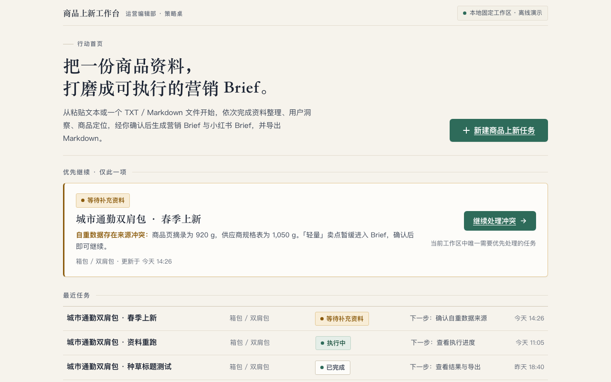
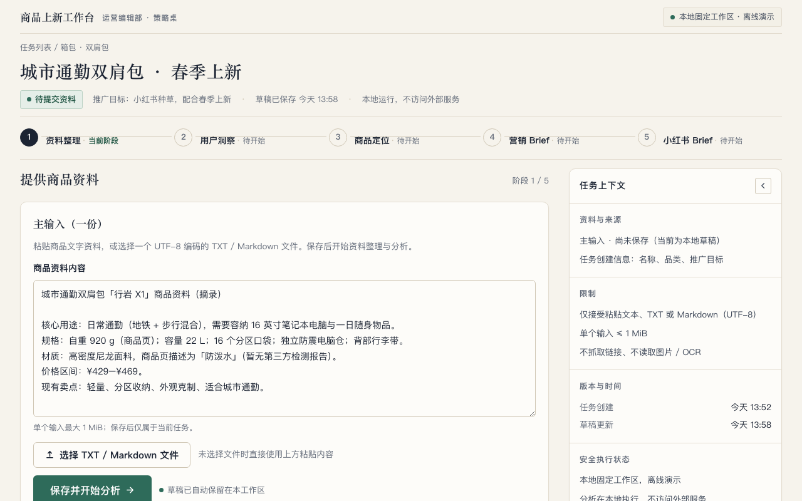
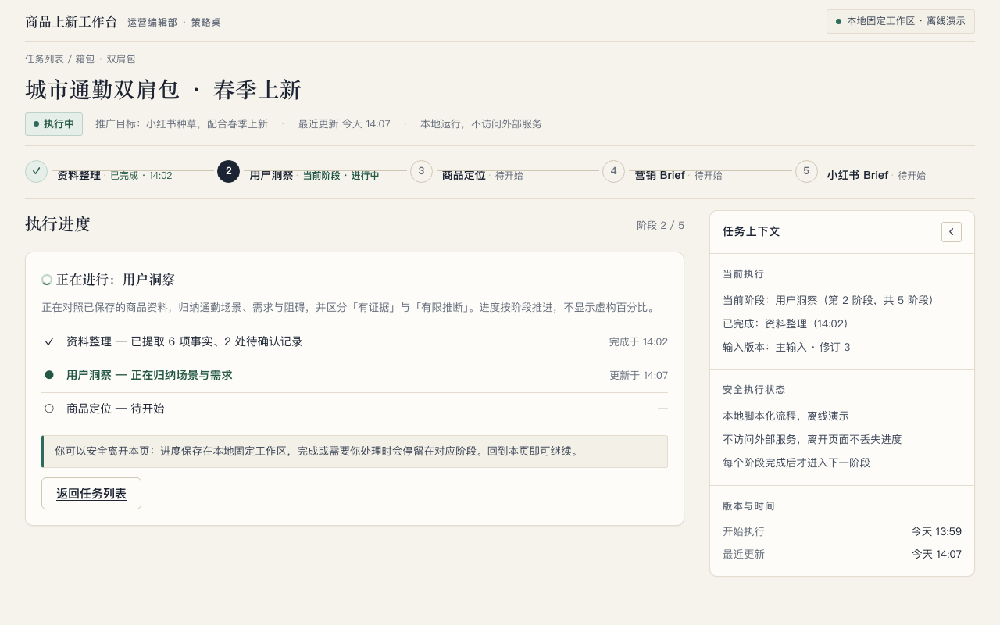
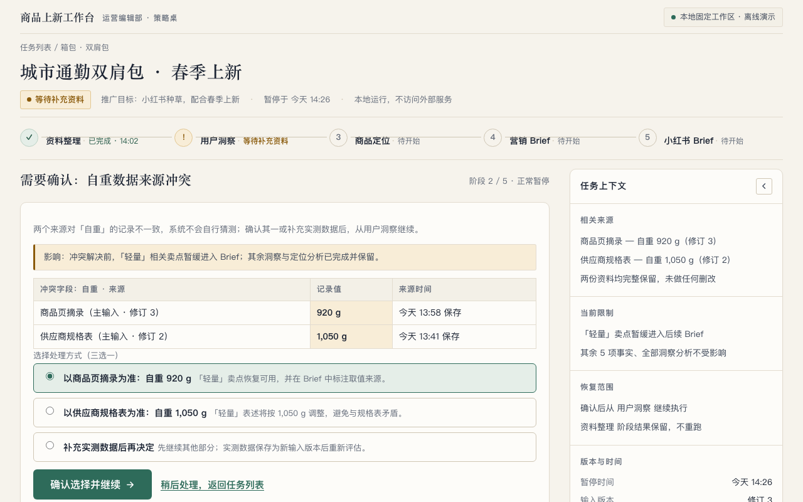
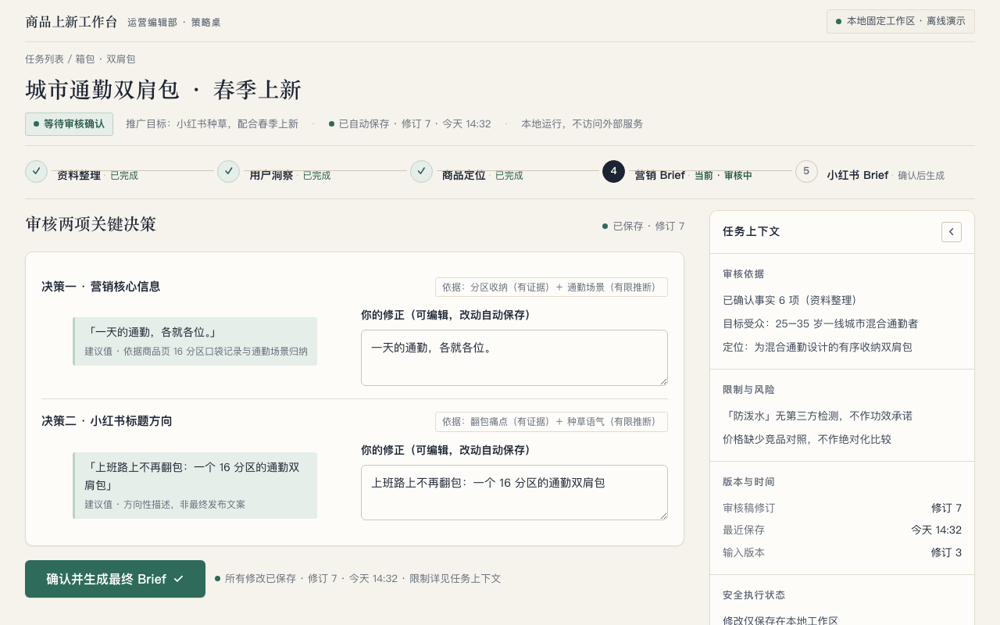
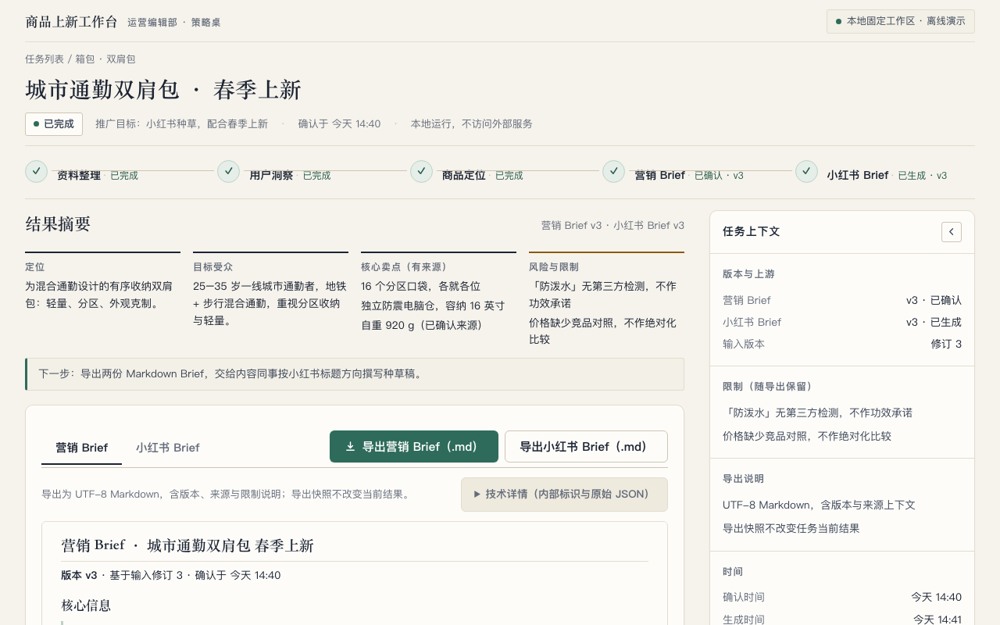
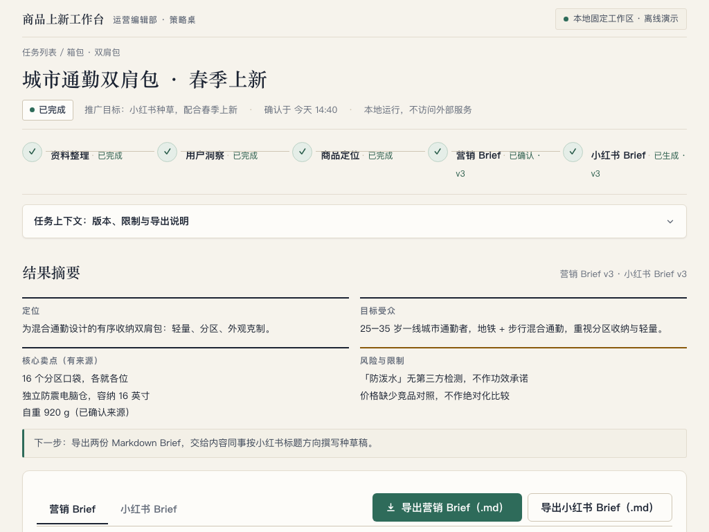
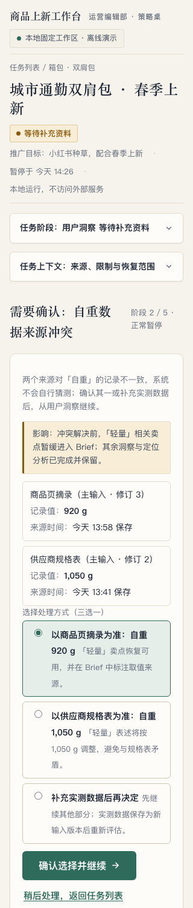

# Frontend Action Workbench 设计 v1（设计交付，非生产实现）

> **Status: PROPOSED — 设计证据交付，等待用户审阅与接受。本文不是 Accepted Decision，不构成生产实现、Provider 验收或 Goal 验收。**
> **交付性质：** Design-only。所有视觉证据来自 `.cache/issue293-prototype/` 下的一次性离线静态原型与本地无头 Chrome 截图；原型不证明任何生产行为，也不会被整体搬进生产代码。
> **权威依据：** [Issue #293](https://github.com/JettxonHo/ai-ecommerce-agent/issues/293) 任务合同；[DEC-082](../decisions/dec-082-local-single-user-action-workbench-and-kimi-frontend-routing.md)（Action Workbench 产品方向与 Kimi 前端窄例外）；[DEC-055](../decisions/dec-055-frontend-application-state-and-verification-foundation.md)、[DEC-056](../decisions/dec-056-deep-task-workbench-revision-safe-interaction-and-proportional-web-quality.md)、[DEC-062](../decisions/dec-062-minimal-recent-task-index-and-stable-deep-links.md)（前端架构与边界）；[frontend-architecture.md](../architecture/frontend-architecture.md)；[user-flows.md](../product/user-flows.md)。
> **日期：** 2026-08-21 · **作者：** 本机 Kimi Code（详见第 10 节身份证据）

---

## 1. 交付边界（Fact）

- 本交付只包含设计证据：一份设计报告与八张代表性截图（见第 8 节），外加被 `.gitignore` 覆盖的一次性静态原型目录 `.cache/issue293-prototype/`。
- 未改动 `apps/web` 下任何文件；未改动依赖、锁文件、配置、测试、OpenAPI、后端、迁移、Current Truth 文档或 Git 元数据。
- 未使用外部素材、图片生成、第二个模型、网络数据或真实用户数据；除本 Issue 明确授权的一次 Kimi managed 设计调用外，未调用项目运行时 DeepSeek / Qwen / OpenAI Provider，亦未读取 Secret、启动 PostgreSQL / 应用 API、部署或执行任何项目 live 行为。
- 全部示例内容为虚构中文数据（`城市通勤双肩包`，型号名「行岩 X1」亦为虚构）。
- 设计被用户明确接受之前，不得据此编写生产实现；接受后还需独立实现 Issue 与 Sol 独立五轴 Review（DEC-082 §4 / §5）。

## 2. 现状审计与保留优势

### 2.1 保留优势（Fact，来自当前源码）

按「Scan → Diagnose → Fix」流程，首先确认当前 `apps/web` 已有的、设计上继续保留的优势：

- **React 19 + Vite SPA 与薄路由**（`App.tsx`）：路由只负责 `/`、`/tasks`、`/tasks/new`、`/tasks/:taskId` 匹配与 Task Identity 提取，符合 DEC-055 / DEC-062。
- **固定工作区与稳定深链**（`TaskWorkbench.tsx` + `projection.ts`）：`panel` / `stage` 通过 URL Search Params 表达，非法值被规范化并 `replace` 回写（`deriveWorkbenchLocation`），刷新与深链可恢复位置。
- **TaskGateway / WorkbenchProjection 接缝**：`deriveWorkbenchMode` 把 `needs_input / review / running / results / recovery / intake` 从 `TaskOverview` 确定性派生；前端不复制后端状态机。
- **语义化表单基线**（`NewTaskRoute.tsx`、`PrimaryInputPanel`）：完整 label / `aria-invalid` / `aria-describedby`、字段级错误就近呈现、`role="status"` / `role="alert"` 异步播报。
- **Focus-visible 基线**（`TaskRoutes.module.css`）：`:focus-visible` 3px 轮廓 + 偏移已存在。
- **Task / revision / 幂等真实性**：Idempotency-Key 复用、`inputRevision` / `resultRevision` 显式呈现、安全 Markdown 边界（无 `dangerouslySetInnerHTML`）、1 MiB 输入上限均为已实现事实。
- **克制结构**：单列阅读、`overflow-wrap: anywhere` 长文本纪律、`minmax(0, 1fr)` 网格防溢出意识。

### 2.2 可见设计问题（Diagnosis，Fact / Observation）

- **英文与技术文案占据主界面**：`Task index`、`Recent tasks`、`Create a task`、`Current workspace: intake`、`Task ID: …`、`Continue in needs_input`、`Next action: resolve_needs_input`（`TaskRoutes.tsx` 的 `actionDescription` 直接展示 command 枚举名）。
- **Raw JSON 与内部标识成为默认表达**：Review 与 Results 用 `<pre>{JSON.stringify(...)}</pre>` 呈现全部候选结果；`ReferenceDetails` 直接列出 Run / Review Package / Brief 的资源 ID。
- **Results 长而无差别**：五类候选结果等权平铺，没有「摘要先行」，没有 Marketing / Xiaohongshu 视图区分。
- **等权白卡网格 + 冷色调**：`.taskCard` / `.details div` 等权白卡、`#f8fafc` 冷灰底、Inter-first 字体栈（`global.css`），与 DEC-082 的中文优先「运营编辑部 / 策略桌」方向不符。
- **占位横幅残留**：`neutralPanelMessage` 显示「…are not implemented in this slice.」。
- **404 / 顶层恢复缺失**：`App.tsx` 的 `*` 路由静默重定向到 `/tasks`，没有 helpful 404；Task 读取失败只有英文一句话 + Retry。
- **正常状态表现力弱**：`saving / saved / unsaved / conflict`、stale + retry 等 DEC-056 要求的产品语义在当前 UI 中没有稳定的视觉位置。

## 3. DEC-082 官方参考模式的综合（Fact：仅模式借鉴，不复制范围）

DEC-082 §Pattern References 已接受一组官方参考资料。本设计只借用其已被接受的模式，不复制其功能范围：

| 参考 | 借用的模式 | 在本设计中的落点 | 明确不复制 |
|---|---|---|---|
| Shopify Home | 首页先给「下一个动作」和最紧急工作 | 行动首页唯一「优先继续」区 + 一个主导新建动作 | 店铺经营模块、订单 / 销售范围 |
| Google Merchant Center | 状态 + 「下一步做什么」 | 最近任务行的「下一步：…」与 Needs Input 的影响 + 有限动作 | 商品 feed 诊断、平台合规范围 |
| Airtable Record Review | 聚焦内容审核，上下文详情在侧 | Review 工作区：语义决策组 + 建议值 / 修正并排 + Context Rail 依据 | 通用表格 / 视图系统 |
| Linear Projects / Notion Workspaces | 渐进披露、宽阔主工作区 | `minmax(0, 1fr)` Active Workspace + 可折叠 Context Rail + disclosure | 多人协作、工作区切换 |
| Copilot Studio flow designer / 飞书多维表格 AI | AI 执行状态位于上下文面板而非主聊天面 | AI 以阶段轨道、进度说明、依据标签出现；无 chat-first、无气泡 | 对话式 Agent 主界面 |
| 抖店 | 电商运营语言（上新、种草、卖点） | 中文运营文案 | mega-navigation、经营范围 |

## 4. 页面层级与任务状态映射（Proposal）

### 4.1 页面层级

```
/tasks（行动首页）
  ├─ 品牌行：商品上新工作台 · 本地固定工作区 · 离线演示
  ├─ 主导动作：新建商品上新任务
  ├─ 优先继续（唯一，Needs Input → Review → Failed/Recoverable → 最近）
  └─ 最近任务（任务/商品 · 品类 · 用户可见状态 · 下一步 · 更新时间）
/tasks/new（新建任务：三字段表单，结构不变，视觉随 token 更新）
/tasks/:taskId（TaskWorkbench 稳定深链）
  ├─ Task Header：商品/任务名 · 品类 · 用户可见状态 · 保存/更新时间 · 本地/离线标签
  ├─ 中文五阶段轨道：资料整理 → 用户洞察 → 商品定位 → 营销 Brief → 小红书 Brief
  ├─ Active Workspace（minmax(0, 1fr)，每时刻一个主导动作）
  └─ Context Rail（展开 320–360px，可折叠；约 1024px 转 disclosure）
```

### 4.2 状态 → 界面映射

状态来源保持 `projection.ts` 的 `WorkbenchMode` 派生不变；下表只是投影到界面的映射（Presentation 层），不新增业务状态：

| WorkbenchMode | Active Workspace | 阶段轨道表现 | 主导动作 |
|---|---|---|---|
| `intake` | 主输入面板（粘贴文本 / TXT / Markdown，≤1 MiB） | 资料整理 = current | 保存并开始分析 |
| `running` | 阶段进度面板：当前阶段、已完成阶段、最近更新、安全下一步；**无百分比** | 当前阶段 = current，其余 done / 待开始 | （状态区即焦点）返回任务列表为次动作 |
| `needs_input` | 正常暂停工作区：问题、影响、来源 / 冲突值、有限动作 | 阻断阶段 = needs-input（琥珀 + 文字） | 确认选择并继续 |
| `review` | 语义决策组 + 有界修正 + 保存状态 / revision | 审核中阶段 = current | 确认并生成最终 Brief |
| `results` | 摘要先行 → Marketing / Xiaohongshu 双视图 + 预览导出 | 全部 done | 导出营销 Brief（.md） |
| `recovery` / `unavailable` | 恢复 / 不可用面板（保留最后快照 + 重试 / 返回） | 如实呈现 failed / 缺失阶段 | 重试 / 返回任务列表 |

阶段轨道每阶段区分 `completed / current / needs-input / blocked`：`✓+已完成`、墨点数字 +`当前`、琥珀 `!+等待补充`、红 `×+已阻断`；内部 enum、profile、version identifier 一律不作为主文案（仅出现在「技术详情」）。

## 5. 设计 Tokens（Proposal）

完整值已在原型 `shared.css` 中以 CSS Custom Properties 落地；以下为验收摘要。

### 5.1 字体（离线系统字体，中文优先）

| Token | 值 | 用途 |
|---|---|---|
| `--font-sans` | `"PingFang SC", "Hiragino Sans GB", "Microsoft YaHei", "Noto Sans CJK SC", "Source Han Sans SC", system-ui, sans-serif` | UI / 正文 |
| `--font-serif` | `"Songti SC", "STSong", "Noto Serif CJK SC", "Source Han Serif SC", serif` | 展示标题（编辑感） |
| `--font-mono` | `ui-monospace, "SF Mono", Menlo, Consolas, monospace` | 技术详情 |

字阶：展示 H1 36（首页）/ 28（任务页），区段标题 21–22 serif，面板标题 17 serif，正文 15–16，辅助 13–13.5，轨道状态 12；中文行高 1.6–1.75。**明确替换 Inter-first 字体栈。**

### 5.2 色彩

| Token | 值 | 用途 |
|---|---|---|
| `--canvas` | `#F6F3EC` | 温暖中性纸面底色 |
| `--surface` / `--surface-sunken` / `--surface-accent` | `#FDFCF9` / `#EFEADE` / `#F3F0E7` | 卡片 / 凹陷井 / 浅层次 |
| `--ink` / `--ink-soft` | `#1C2433` / `#3C4657` | 墨色·深海军蓝结构与文字 |
| `--muted` / `--faint` | `#646C7A` / `#8B8FA0` | 次级 / 三级文字 |
| `--line` / `--line-strong` | `#E3DCCF` / `#CFC6B4` | 细规则线 |
| `--accent` / `--accent-strong` / `--accent-pressed` | `#2E6B5A` / `#245846` / `#1D4A3B` | **唯一行动强调色（低饱和松绿）** |
| `--accent-wash` / `--accent-line` | `#E5EEE8` / `#BCD2C5` | 当前态浅底 / 浅边 |
| `--amber` + wash/line | `#8A5A0B` / `#F8EDD7` / `#E2C793` | 仅语义等待 / 警示 |
| `--red` + wash/line | `#A4342A` / `#F8E7E2` / `#E3B2A8` | 仅语义错误 / 阻断 |
| `--focus-ring` | `#1C2433` | 聚焦轮廓 |

白字于 `--accent` 对比度约 5.4:1；`--muted` 于 `--canvas` 约 4.6:1（AA 正文）。无紫色 AI 渐变、无装饰性指标、无伪造百分比 / 置信度。

### 5.3 间距 / 圆角 / 边与影 / 动效

- 间距：4px 基网 `--s1…--s8` = 4 / 8 / 12 / 16 / 24 / 32 / 48 / 64。
- 圆角：克制编辑感 `--r-sm:3px / --r-md:6px / --r-lg:10px`。
- 边与影：1px 细规则线为主；`--shadow-1: 0 1px 2px rgba(28,36,51,.07)`；抬升 `--shadow-2` 增加 `0 6px 18px rgba(28,36,51,.08)`；层级靠排版、细线与浅影，不靠厚投影。
- 动效：`--motion: 140ms cubic-bezier(.2,.6,.3,1)`，仅 hover / 焦点 / disclosure 过渡；`prefers-reduced-motion: reduce` 下全部动画与过渡降为即时。

## 6. 界面 / 组件清单与当前模块映射（Proposal，不声称已实现）

| 界面 / 组件 | 说明 | 映射到当前模块 | 备注 |
|---|---|---|---|
| App Shell（品牌行、skip-link、truth-chip） | 全站一致的中文品牌行与「本地固定工作区 · 离线演示」真实标签 | `App.tsx` + `App.module.css` + `styles/global.css`（tokens） | skip-link「跳到主要内容」聚焦前视觉隐藏 |
| 行动首页（Hero、主导新建、唯一优先继续、最近任务行、底线说明） |  ruled list 而非等权白卡 | `TaskRoutes.tsx` `RecentTasks` + `TaskRoutes.module.css` | 数据来源仍是 `listTasks()`，只改呈现 |
| 新建任务表单 | 三字段结构不变，视觉随 tokens | `NewTaskRoute.tsx` + 共享 CSS Module | 校验、幂等、错误语义不变 |
| Task Header | 商品/任务名、品类、用户可见状态、保存/更新时间、local/offline 标签 | `TaskWorkbench.tsx` 头部区 | 状态文案来自映射表（见 6.1） |
| 中文五阶段轨道 | `资料整理 → 用户洞察 → 商品定位 → 营销 Brief → 小红书 Brief`，四态区分 | `TaskWorkbench.tsx` + `projection.ts`（`stageCatalog` 顺序不变） | enum→中文标签为纯呈现映射 |
| Active Workspace（各 mode 面板） | 每时刻一个主导动作 | `TaskWorkbench.tsx`（Intake / Progress / Review / Results 私有模块的呈现层） | 模块边界与 Intent 语义不变 |
| Context Rail（320–360px） | 资料与来源 / 限制 / 版本与时间 / 安全执行状态分区 | `TaskWorkbench.tsx` 新右栏 + `TaskWorkbench.module.css` | ≤约 1024px 折叠为 disclosure |
| 状态标记 `.state-tag` | 永远「图形 + 文字」，不只靠颜色 | 共享样式 | 变体：current / waiting / error / done |
| 冲突来源对照表 | Needs Input 的来源 / 记录值 / 时间 | `TaskWorkbench.tsx` Needs Input 面板 | 窄屏堆叠为卡片（见 7.3 注） |
| 语义决策组（建议值 ‖ 修正并排） | Review 的可决定语义单位 + 依据标签（有证据 / 有限推断） | `TaskWorkbench.tsx` `ReviewPanel` | 替代 `<pre>JSON` |
| 结果摘要条 | 定位 / 受众 / 核心卖点 / 风险 + 下一步 | `TaskWorkbench.tsx` `ResultPanel` | 摘要先行 |
| Brief 双视图 Tabs + Markdown 预览（区域内滚动） | Marketing / Xiaohongshu 分离 | `ResultPanel` | 生产实现须走 DEC-056 安全 Markdown 渲染边界 |
| 导出动作组 | 两份 UTF-8 Markdown + 版本 / 限制说明 | `ResultPanel`（`exportBrief` 已有 seam） | 契约不变 |
| 技术详情 disclosure | 内部 ID 与 raw JSON 的唯一位置，默认闭合 | `TaskWorkbench.tsx` `ReferenceDetails` 改造 | 截图中不可见 JSON |
| 404 / Unavailable / 顶层恢复 | helpful 404 与任务不可用面板（中文、返回 + 重试） | `App.tsx` catch-all + `TaskRoutes.tsx` 错误分支 | 替代静默重定向 |

### 6.1 文案映射原则

英文 enum / command（如 `resolve_needs_input`、`product_intake_and_fact_extraction`）只在呈现层映射为中文（如「确认自重数据来源」「资料整理」），映射表是 Workbench 模块内的纯函数；gateway DTO、`projection.ts` 派生逻辑与后端契约不变。未知状态不得被用来猜测写操作（DEC-056 约束原样保留）。

## 7. 交互、状态、响应式与可访问性（Proposal）

### 7.1 交互全态

- **Hover**：主按钮 `--accent→--accent-strong`；次按钮边框加深 + 浅底；链接颜色加深并保留下划线；最近任务行浅底 `--surface-accent`。
- **Pressed**：`translateY(1px)` 并去除投影（主 / 次按钮一致）。
- **Focus-visible**：`2px solid --focus-ring` + `2px` 偏移 + 小圆角；skip-link 聚焦时落入视口；disclosure summary、tab、radio 均可见聚焦。
- **Disabled / 不可用**：降透明度 + `cursor: not-allowed`，并保留原因说明文字（不可用不只靠置灰）。

### 7.2 状态处理（对应 DEC-056 产品语义）

- **Loading**：`role="status"` 文字 + 简单旋转图形 + 阶段事实（当前 / 已完成 / 更新时间），**无虚构百分比**。
- **Empty**：行动首页空列表 = 编辑式空态文案 + 保留主导「新建商品上新任务」；任务内空结果 = 一句话指引回主输入。
- **Error**：`role="alert"` 面板，说明发生了什么 + 保留内容 + 手动重试；字段错误紧邻字段，单文件拒绝留在文件行；Toast 不作错误唯一载体。
- **Stale**：已有成功快照但暂时刷新失败时，保留原界面并在标题行内联提示「数据可能不是最新 · 最后更新 ××:×× · 重试」；依赖新鲜前置的写入暂停，本地缓冲保留。
- **Unavailable**：无成功快照且读取明确失败 / Task 不存在时进入不可用面板（说明 + 重试 + 返回任务列表），不显示原始错误文本。
- **404**：helpful 404 页（中文说明「没有这个页面」+ 返回任务列表 + 若为任务深链则提示任务可能不存在），替代当前静默重定向；顶层不可恢复 UI 错误仍走 Route Error Boundary。
- **Saved / Saving / Unsaved / Conflict**：Header 与工作区标题行常驻保存状态（`已自动保存 · 修订 n · 时间`）；冲突时保留缓冲并给手动重试，不无限重试。

### 7.3 响应式

- 主目标 `1280×800`；`1024×768` 保持完整布局，Context Rail 折叠为位于工作区上方的「任务上下文」disclosure（见 `task-results-1024.png`）。
- ≤720px：阶段轨道与 Context Rail 均转为可访问 disclosure；单列阅读顺序 = Header → 阶段 disclosure → 上下文 disclosure → Active Workspace；冲突表堆叠为卡片。
- `320 CSS px` 仅为可访问性 reflow 验证（桌面 Chrome 高缩放等价），**不构成手机产品**；页面级无横向滚动（宽表 / 长内容只在其自身区域内滚动）。
- 注（Open Question）：原型中窄屏冲突表以 `display:block` 堆叠，生产实现需在「保留 table 语义 + 区域滚动」与「堆叠卡片」之间做最终可访问性取舍并验证。

### 7.4 可访问性基线

语义化 HTML（`nav/ol/li/table/fieldset/legend/details/summary/blockquote`）、完整 label / description、键盘可达、非颜色唯一状态（图形 + 文字双信号）、`prefers-reduced-motion`、异步状态 `role="status"/"alert"` 播报、200% 文本缩放下不溢出（依托流式单列与 `overflow-wrap`）。WCAG 2.2 A / AA 仍是设计与验证基线，但不宣称未经审计的合规认证（DEC-056）。

## 8. 代表性截图与验收说明（Fact：离线静态原型渲染）

渲染方法：本地 Google Chrome `151.0.7922.172` 无头模式（`--headless=new --disable-gpu --hide-scrollbars --force-device-scale-factor=1 --window-size=<宽,高> --screenshot`），`file://` 本地页面，device scale 1，无网络访问。1280 截图视口 `1280×800`，1024 截图视口 `1024×768`。`320` 证据：无头 Chrome 最小窗口宽为 500，改用「640 宽窗口 + 居中 320 宽 iframe」产生真实 320 CSS px 视口后居中裁切至 `320×1500`（内页脚本自报 `scrollWidth − clientWidth = 0`）。全部页面在各自目标宽度下页面级横向溢出均为 0（脚本注入测量，1280 / 1024 / 500 直接测量，320 经内页自测 + 目检）。**静态原型截图只证明设计表达，不证明生产行为。**

### 8.1 行动首页 `1280×800`



验收点：中文优先产品标题与「本地固定工作区 · 离线演示」真实标签；唯一主导「新建商品上新任务」；唯一优先恢复项（等待补充资料，Needs Input 优先序）含影响与下一步；最近任务行展示任务/商品、品类、用户可见状态、下一步、更新时间；无图表 / KPI / 搜索 / 筛选 / 批量 / 归档 / 巨型导航。

### 8.2 任务录入 `1280×800`



验收点：Header 含任务/商品、品类、用户可见状态、草稿保存时间与本地/离线标签；中文五阶段轨道当前态清晰；Active Workspace 只有一个主导动作（保存并开始分析），支持粘贴文本与 TXT/Markdown 选择并标注 1 MiB 限制；右侧 320–360px Context Rail 展开，承载资料与来源、限制、版本与时间、安全执行状态。

### 8.3 任务执行中 `1280×800`



验收点：同一稳定壳；completed / current / upcoming 由「✓+已完成 · 时间」「墨点+当前阶段 · 进行中」「空心+待开始」区分，不依赖颜色；进度面板给出当前阶段、已完成阶段、最近更新、正在发生什么与安全下一步（可离开、进度保留）；**无虚构百分比**。

### 8.4 任务等待补充资料 `1280×800`



验收点：作为正常工作区而非错误页；一个真实风格的有界阻断（自重来源冲突 920 g vs 1,050 g）含问题、影响、可见来源 / 冲突值与三个有限动作；唯一主导动作「确认选择并继续」；Context Rail 含相关来源、当前限制与恢复范围（确认后从用户洞察继续、已完成阶段不重跑）。

### 8.5 任务审核 `1280×800`



验收点：结构化语义决策（营销核心信息、小红书标题方向），建议值与修正并排，依据以「有证据 / 有限推断」标签上下文呈现；无 raw JSON；保存状态与 revision（已自动保存 · 修订 7 · 时间）常驻；唯一主导动作「确认并生成最终 Brief」。

### 8.6 任务结果 `1280×800`



验收点：摘要先行（定位、目标受众、核心卖点、风险与限制、下一步）；Marketing Brief 与 Xiaohongshu Brief 为两个独立 Tab 视图（图中为营销 Brief 视图，小红书视图同构）；Markdown 预览在自身区域内滚动，导出动作与版本 / 限制说明可见；raw JSON / 内部 ID 只位于默认闭合的「技术详情」之后，截图中不可见；默认页面长度受控。

### 8.7 任务结果 `1024×768`



验收点：Context Rail 折叠为工作区上方的「任务上下文：版本、限制与导出说明」disclosure，不遮挡当前任务；摘要转为两列；Brief 操作保持可见；无页面级横向裁切（溢出测量 = 0）。

### 8.8 任务等待补充资料 `320 CSS px` reflow



验收点：仅为可访问性 reflow 证据（桌面高缩放等价），非手机产品；单列阅读顺序完整（Header → 阶段 disclosure → 上下文 disclosure → 阻断工作区 → 主导动作）；阶段与上下文均为可访问 disclosure；冲突表堆叠为卡片；真实 320 CSS px 视口内无页面级横向裁切（内页自测溢出 = 0）。

## 9. 保留 / 改变 / 不建设（Proposal）

| 类别 | 内容 |
|---|---|
| **保留（Retain）** | React/Vite 基础与薄路由；固定工作区；稳定深链与 URL 规范化；TaskGateway / WorkbenchProjection 接缝与 mode 派生；语义表单、字段错误、aria 播报；focus-visible 基线；Task / revision / 幂等 / 1 MiB / 安全 Markdown 边界；Needs Input / Review / Invalidation 作为正常工作区而非错误页 |
| **改变（Change）** | 全部界面文案中文化（enum / command 只在呈现层映射）；视觉 tokens 替换为暖纸面 + 墨色/深海军蓝 + 单一松绿强调（琥珀 / 红仅语义）；首页从任务卡列表改为「主导动作 + 唯一优先继续 + ruled 最近任务」；TaskWorkbench 增加 Task Header、中文五阶段轨道、Context Rail；Review 改语义决策组；Results 改摘要先行 + 双 Brief 视图 + 区域内预览；raw JSON / 内部 ID 收拢到「技术详情」；`*` 路由改 helpful 404；占位横幅删除；字体栈去 Inter-first |
| **不建设（Do-not-build）** | 图表 / KPI / Dashboard；搜索 / 高级筛选 / 批量 / 归档；mega-navigation；chat-first 或聊天气泡主界面；伪造百分比 / 置信度；紫色 AI 渐变与等权白卡网格；销售 / 订单 / 物流 / 支付模块；手机专用产品；任何后端字段、动作、OpenAPI、迁移或 Provider 变更；泛化 Sanitizer 平台与无实际边界的设计系统框架 |

## 10. Kimi 调用证据（Fact）

- 请求的 CLI 模型别名：`kimi-code/k3`（Issue #293 指定）。
- CLI 版本：`kimi --version` → `0.33.0`。
- `kimi doctor` → PASS（`config.toml`、`tui.toml` 校验通过）。
- 配置映射（`~/.kimi-code/config.toml`，仅结构摘录，未读取任何凭据内容）：`[models."kimi-code/k3"]` → `provider = "managed:kimi-code"`, `model = "k3"`，即 `kimi-code/k3 → managed:kimi-code → k3`；`max_context_size = 1048576`，`default_effort = "max"`。
- 调用前 Auth readiness 仅以 managed OAuth 配置存在为据：`[providers."managed:kimi-code".oauth] storage = "file"`；未读取或摘录任何凭据内容。修正后的唯一一次 Kimi 调用成功结束，但该成功不构成对凭据内容或运行时模型身份的独立验证。
- **运行时身份：运行环境未独立暴露实际执行模型，记录为 `UNVERIFIED_RUNTIME_MODEL`。** 不据此声称任何运行时模型身份。
- 调用次数与失败边界：首次 CLI 参数组合在 Provider 前被拒绝，模型 / Provider 调用数为 0；用户随后明确授权一次修正调用，按 `kimi -m kimi-code/k3 -p "$(cat .cache/issue293-prototype/kimi-task.md)"` 执行并以退出码 0 完成。未重试、恢复、续跑、切换模型或替换 Provider。
- 本次调用范围：仅 Issue #293 合同内的前端设计工作；除上述 Kimi managed 设计调用外，不涉及项目后端 Provider、Secret、PostgreSQL、OpenAPI、部署或 Goal 事项。

## 11. 实施交接建议（Proposal；仅限当前前端模块）

1. **Tokens 落位**：把第 5 节 tokens 写入 `styles/global.css` 的 `:root` custom properties（替换 Inter-first 字体栈与冷色板），不改构建与依赖。
2. **行动首页**：在 `TaskRoutes.tsx` `RecentTasks` 内重排为 Hero / 唯一优先继续 / ruled 最近任务；优先项选择逻辑 = Needs Input → Review → Failed/Recoverable → 最近活跃，只读 `TaskSummary` 现有字段（`needsInputRequest` 等已由 overview 提供，列表页如需同字段由实现 Issue 在契约内核实，不新造字段）。样式集中在 `TaskRoutes.module.css`。
3. **Workbench 壳**：在 `TaskWorkbench.tsx` 内组合 Task Header / 中文五阶段轨道 / Workspace grid / Context Rail（340px，落在 320–360 区间）；`projection.ts` 的 mode / location 派生保持不变，仅新增「enum→中文标签」与「state→轨道态」纯呈现映射函数。
4. **各 mode 面板**：Intake 保留现有表单语义改排版；Progress 新增无百分比进度面板；Needs Input 用冲突对照表 + 有限动作；Review 用语义决策组替代 `<pre>JSON`；Results 用摘要条 + Tabs + 区域内预览 + 导出组；`ReferenceDetails` 改造为默认闭合的「技术详情」。
5. **状态与恢复**：`App.tsx` catch-all 改 helpful 404 组件；`TaskRoutes.tsx` 错误分支改中文 Unavailable 面板（重试 + 返回）；stale + retry 按 DEC-056 §3 呈现在标题行。
6. **可访问性验证**：沿用 DEC-055 / 056 既定工具链（Vitest + RTL、Playwright Chromium、代表性 axe 检查 + 人工键盘 / Focus / 200% 文本 / 320 等价 reflow 验证），不新增浏览器矩阵或视觉回归平台。
7. **安全边界**：Markdown 预览必须走 DEC-056 已接受的安全渲染路径（禁 `dangerouslySetInnerHTML`、限制链接协议）；本设计不改变任何 gateway / OpenAPI / 后端行为。

## 12. 已知限制与开放视觉问题（Fact / Open Question）

- 原型为静态页面：无真实数据绑定；hover / pressed / focus 等动态态以 tokens 与 CSS 规定但未逐帧截图；empty / error / stale / unavailable / 404 已在第 7 节规定但未出图（属下一轮设计或实现验收内容）。
- 小红书 Brief 视图与营销 Brief 视图同构，未单独截图；两视图内容均已在原型中实现（Tab 切换为纯本地 JS）。
- 展示衬线字体（Songti SC 等）跨平台存在性不一，已给系统字体回退栈；正式支持目标仍为当前稳定 Desktop Chrome（DEC-056），其余浏览器 best-effort。
- Context Rail 折叠断点原型取 1100px，与 DEC-082「约 1024px」一致范围内的精确断点留待实现时按真实内容测量确定（Open Question）。
- 窄屏冲突表的「堆叠卡片」与「保留 table 语义 + 区域滚动」取舍需在实现期做最终可访问性验证（Open Question，见 7.3）。
- 阶段轨道 `blocked` 态（红 `×+已阻断`）已在 tokens 规定但无对应截图；recovery 面板视觉与 unavailable 共用壳，未单独出图。
- 原型未覆盖 New Task 表单页截图（结构不变，仅 tokens 适用）。

## 13. 边界声明（Fact）

- 本设计交付的**接受不等于生产实现**：实现须另立 Issue，由 DEC-071 / DEC-082 路由规定的实现 Agent 在精确合同内完成，并经 Sol `ORCHESTRATOR_REVIEWER` 独立五轴 Review；Kimi 产出不得自我批准或合并。
- 本设计**不等于 Provider 验收**：不改变两次受控 smoke 失败后的 `GOAL_BLOCKED`，不授权任何新的 Provider run、DEC-081 Phase B 或生产修复。
- 本设计**不等于 Goal 验收**：MVP-0 Fast Lane 保持 `GOAL_BLOCKED`；本交付不启动、不关闭任何 Goal。
